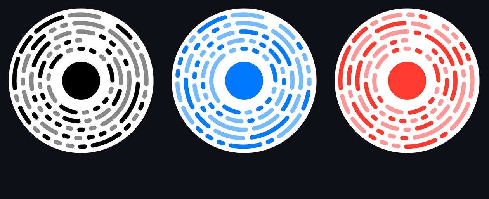

<div align="center">



# encke

**Apple App Clip Codes in pure TypeScript.**
No macOS. No native binaries. Bit-for-bit identical to Apple's own generator.

<sub>Named after the comet with the shortest known orbit — it comes back every 3.3 years.</sub>

[](https://www.npmjs.com/package/encke)
[](./LICENSE)
[](./dist/index.d.ts)
[](./package.json)

```bash
npm install encke
```

</div>

---

Apple gives you `AppClipCodeGenerator` — a macOS-only CLI you have to shell out to. Fine for a one-off poster, useless if you want to generate codes on a server, per request, inside CI, or on any machine that isn't a Mac.

This package reimplements the whole format from scratch: URL compression, Reed-Solomon error correction, and the ring renderer. Same input, same bytes out. Diff one against Apple's tool if you like.

## Quick start

```ts
import { generateAppClipCode } from "encke";

const { svg } = generateAppClipCode({ url: "https://oru.okuso.uk/su" });
```

`svg` is a self-contained SVG string. There's also `generateDataURL()` for a ready-to-embed `data:image/svg+xml` URI.

### React / Next.js

```tsx
import { AppClipCode, AppClipCodeImg } from "encke/react";

<AppClipCode url="https://oru.okuso.uk/su" width={220} />
<AppClipCodeImg url="https://oru.okuso.uk/su" width={220} alt="Scan me" />
```

**Where this runs decides what it costs.** The encoder needs a 1.7 MB Huffman model. Your users only pay for it if their browser is the thing doing the encoding:

| Where you render | What the browser downloads |
|---|---|
| Server Component, route handler, `generateStaticParams` — the App Router default | Nothing. The tables are read from disk in Node; the client receives finished SVG markup. |
| Client Component, URL known at build time | Nothing, if you generate on the server and pass the SVG down. |
| Client Component, URL typed by the user | The tables — but as a lazily-fetched chunk, never in your main bundle. |

`encke/react` itself is 31 KB. Nothing statically imports the tables.

For that last row, the component loads them on its own and re-renders — no `useEffect` on your side:

```tsx
"use client";

<AppClipCode
  url={url}
  fallback={<Skeleton />}
  tables={{ baseUrl: "/appclip-tables" }}   // serve data/*.data yourself: 0 KB of JS
  onError={e => setMessage(e.message)}
/>
```

Drop `tables` and it fetches the embedded copy instead (~1.4 MB, still its own chunk). Pass `tables={false}` if you would rather `await loadTables()` once yourself at app start.

`fallback` covers everything that is not a finished code — tables still loading, a URL that overflows 128 bits, a color pair that will not scan — and `onError` tells you which.

## Options

<table>
<tr><td><b>url</b></td><td>Your App Clip URL. Must fit in 128 bits after compression — short domains with short paths do (<code>/su</code> costs 65 bits), long query strings usually don't.</td></tr>
<tr><td><b>foreground</b><br><b>background</b></td><td>Hex colors, <code>#</code> optional.</td></tr>
<tr><td><b>templateIndex</b></td><td>One of the 18 built-in color schemes — the same ones Apple's CLI offers via <code>--index</code>. Overrides fg/bg.</td></tr>
<tr><td><b>center</b></td><td>What sits in the middle: <code>"disc"</code> (default, plain solid disc) · <code>"none"</code> · or your own SVG string designed around <code>(0,0)</code>.</td></tr>
<tr><td><b>centerScale</b></td><td>Scale for a custom center. Keep the visible chunk around 210 units — the camera needs a solid high-contrast blob to lock onto.</td></tr>
<tr><td><b>lockupSvg</b></td><td>Optional branding strip under the ring. Your SVG, your artwork.</td></tr>
<tr><td><b>tint</b></td><td>The secondary arc color. Leave it out — it is derived from your palette, and getting it wrong is the usual reason a color code stops scanning.</td></tr>
<tr><td><b>layout</b></td><td><code>"code"</code> is a tight 800×800 canvas; <code>"lockup"</code> leaves room under the ring for <code>lockupSvg</code>. Default <code>"auto"</code> picks by whether you passed one.</td></tr>
<tr><td><b>allowUnscannableColors</b></td><td>Off by default: a pair that will not scan throws rather than quietly producing a dead code. Set it to override.</td></tr>
</table>

```ts
generateAppClipCode({
  url: "https://oru.okuso.uk/menu",
  templateIndex: 13,
  center: '<circle cx="0" cy="0" r="60" fill="#007AFF"/>',
  lockupSvg: '<text x="400" y="985" text-anchor="middle" font-size="64">YOUR BRAND</text>',
});
```

Every call returns `{ svg, rawBits, payloadHex, arcCount, colors }` — the debug fields are useful when a URL doesn't fit and you want to know why.

### Will this URL fit?

The 128-bit budget is the one real constraint. Ask before you generate:

```ts
import { estimatePayloadBits } from "encke";

estimatePayloadBits("https://oru.okuso.uk/su");
// { bits: 65, limit: 128, headroom: 63, willFit: true }

estimatePayloadBits("https://very-long-subdomain.example.com/a/deep/path?with=query");
// { bits: 173, headroom: -45, willFit: false, reason: "173 bits, 45 over the limit" }
```

It never throws — an unencodable URL comes back as `{ bits: null, reason }`.

### Will these colors scan?

```ts
import { checkColors, suggestColors } from "encke";

checkColors("777777", "888888");
// { ok: false, contrast: 1.15, lumaDelta: 17, reason: "brightness difference 17 (needs ≥ 100), contrast 1.15:1 (needs ≥ 2.8:1)" }

suggestColors("777777", "888888");  // three built-in pairs, closest first
```

`generateAppClipCode` runs this check for you and refuses bad pairs unless you pass `allowUnscannableColors`.

### Browsers and Workers

Node — including Next.js server components and route handlers — needs no setup: the Huffman tables are read from the package's `data/` directory on first use, and every API stays synchronous.

Anywhere without a filesystem, load them once:

```ts
import { loadTables, generateAppClipCode } from "encke";

await loadTables();                                  // ~1.5 MB, a separate lazy chunk
await loadTables({ baseUrl: "/appclip-tables" });    // or serve data/*.data yourself — zero bundle cost
generateAppClipCode({ url });                        // synchronous from here on
```

`generateAppClipCodeAsync()` does both in one call. The tables are never part of your main bundle: importing `encke` costs about 31 KB.

## CLI

```bash
npx encke --url https://oru.okuso.uk/su --index 11 --output code.svg
npx encke estimate --url https://oru.okuso.uk/menu
npx encke check --foreground 777777 --background 888888
npx encke templates
```

Flags mirror Apple's own tool (`-u -o -i -f -b`), so existing scripts port over. Without `--output` the SVG goes to stdout.

## What's actually in one of these codes

```
URL ──▶ huffman ──▶ ≤128 bits ──▶ RS + scramble ──▶ 208 bits ──▶ 128 slots + color stream
```

<details>
<summary><b>The pipeline, in detail</b></summary>

<br>

**Compression.** Apple's encoder throws everything at the 128-bit budget: context-aware Huffman coding (three tries, two-symbol lookback), a 156-word dictionary for path segments, LEB128 for integers, a 6-bit custom alphabet, special codes for ~20 common TLDs, and a "template" mode where a known word like `/menu` costs 8 bits flat. The encoder tries several strategies per URL and keeps the shortest.

**Error correction.** The payload is scrambled (reverse + XOR `0xA5`), then wrapped in two Reed-Solomon codes — GF(256) over the structure bits, GF(16) over the metadata — so a scuffed, glare-covered print still scans.

**Rendering.** The 128 bits decide which slots in the five concentric rings are visible (bit `0` = drawn). The bits after that are a color stream painting each visible arc: foreground, or a pastel tint of it. Visible slots swallow adjacent hidden slots, which is why every URL gets its own pattern of arc lengths.

</details>

<details>
<summary><b>Why some color codes don't scan (and how this package avoids it)</b></summary>

<br>

Each Apple template is secretly a *triple*: foreground, background, and a pastel secondary. Teal `00A6A1` pairs with `88DDCC` — not gray. Using a flat gray as the second color breaks the scanner's color clustering and codes quietly stop scanning. We extracted all 18 triples from Apple's own output, so `templateIndex` just works; for custom colors the package computes a matching tint.

</details>

## Scannability

- **Chunky center wins.** Thin outlines and detailed logos fail. ~210 units of solid, high-contrast shape is the sweet spot.
- **Contrast beats aesthetics** if you roll your own colors.
- **Test on a real iPhone before printing.** The Camera app opens the App Clip or it doesn't — there's no partial credit.

## Verification

Every claim here is checked against Apple's own `AppClipCodeGenerator` on macOS, not against itself.

- **790 URLs**, differentially tested: our compressed bitstream is identical to the native encoder's for every one. The corpus spans all three host formats, LEB128 boundaries, subdomains, fragments, trailing slashes, and path+query combinations.
- **156 dictionary words and 113 fixed TLDs**, each index read back individually from native output rather than guessed from the binary's string table.
- **52 of those URLs** are committed as fixtures with their full arc geometry, so `npm test` reproduces the check on any machine without the native tool. `npm run test:oracle` regenerates them.
- **All 18 color templates** match the native output exactly, foreground, background and tint.
- **624 color pairs** sampled from the native validator back the scannability check; **85 pairs** back the custom-color tint.

That comparison is what makes the claim worth anything — it caught a stack of defects that produced perfectly plausible-looking codes:

| Defect | Effect |
|---|---|
| The template-type flag was computed but never written | Decoders read the payload in the wrong mode — the code scanned to a different URL |
| The URL parser only looked for a query when there was no path | `…/item?p=7` silently encoded as `…/item` |
| Two bogus dictionary entries, two real ones missing | 118 of the 156 word indices were off by one — again, wrong URL |
| Host encoding format 1 was never implemented | Codes for 113 TLDs were larger than necessary |
| Tie-breaks preferred the first candidate; Apple prefers a fixed order | Divergent codes whenever two encodings came out the same length |
| The Huffman tie-break compared the alphabetically smallest symbol in a subtree instead of its leftmost leaf | One wrong bit, rarely, which is enough |
| The last arc in a ring did not wrap past 0° | Visibly wrong geometry on most codes |
| `compressURL()` left-aligned the payload the codec reads right-aligned | Its output did not match what the generator actually encodes |

Full notes in [`RE_NOTES.md`](./RE_NOTES.md).

Two things remain approximations, and both are measured rather than assumed: the secondary color for **custom** palettes (exact on 82% of sampled pairs, always within one 4-bit step, hue always preserved), and the scannability threshold (97% agreement with the native validator, with all 18 built-ins passing). Built-in templates use Apple's exact values.

## No Apple artwork inside

This package ships **zero Apple trademarks or artwork**: no "App Clip" badge, no Apple logo, no camera glyph. Those are Apple's IP and don't belong in an MIT-licensed package. The ring is the deterministic output of an algorithm applied to your URL — a format, not a logo. Anything decorative in your SVG comes from you.

If you want the official badge on marketing material, generate it with Apple's own tools and place it next to the code.

## Development

```bash
npm run build       # tsup → dist/ (ESM + CJS + types)
npm run playground  # live preview at localhost:5199
npm test            # 132 tests, including the oracle fixtures
npm run test:oracle # regenerate the fixtures from the native tool, then test (macOS only)
npm run test:pack   # pack, install into a clean project, exercise every entry point
```

## License

[MIT](./LICENSE). Huffman coding and Reed-Solomon are public-domain mathematics. Color tables and tries were extracted from Apple's distributed binaries as interoperability facts.
